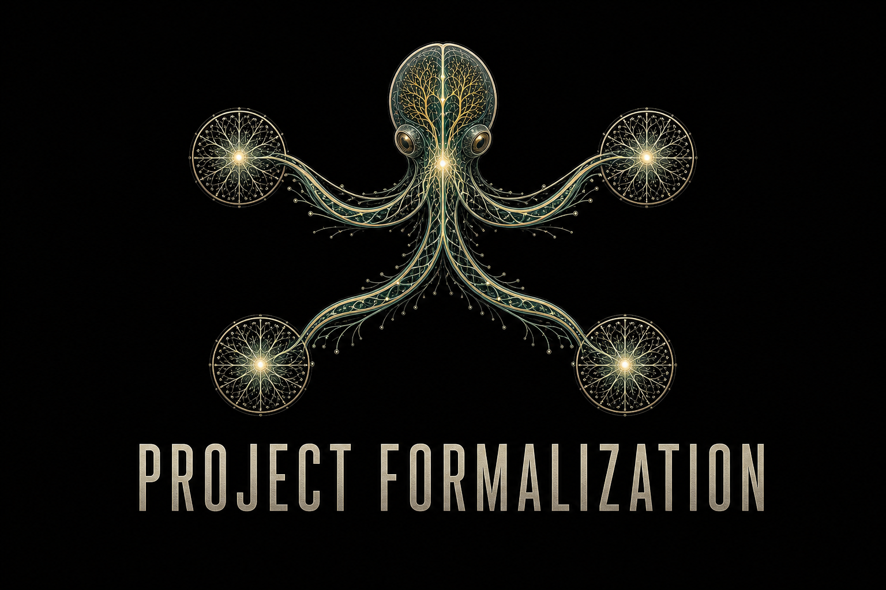

# Project Formalization

[](https://github.com/gokdeniz-cakir/project-formalization-public/actions/workflows/public-audit.yml)
[](LICENSE)


Project Formalization combines bounded formal methods, production replays, and
independent review to find and validate software safety failures. This public
repository contains the reusable Codex skills, judge-facing sample cases, and
already-disclosed evidence used by the project.

## Try It

No account, build, or local toolchain is required for these judge-facing paths:

- [Project overview](https://gokdenizcakir.com/project-formalization)
- [Interactive DTLS 1.3 ACK boundary lab](https://gokdenizcakir.com/demo/)
- [CVE-2026-6679 evidence and agent replay](https://gokdenizcakir.com/replays/)
- [Public code repository](https://github.com/gokdeniz-cakir/project-formalization-public)

The demo lets judges move between the closest clean control and the exact
failing boundary. The replay page exposes the model, independent sanitizer
results, coordinator/critic handoffs, selected transcript excerpts, and claim
limits without requiring a vulnerable production build.

## Judge Quickstart

### Fastest path: browser only

1. Open the [interactive lab](https://gokdenizcakir.com/demo/).
2. Run the verification sequence and move the pending-record control through
   the boundary.
3. Open the [replay case file](https://gokdenizcakir.com/replays/) to inspect
   the arithmetic model, production replay matrix, agent handoffs, and source.

### Five-minute local verification

Prerequisites:

- Python 3.10 or newer
- `pip`
- Optional: GCC or Clang to compile the bundled C boundary model

```sh
git clone https://github.com/gokdeniz-cakir/project-formalization-public.git
cd project-formalization-public
python -m pip install -r requirements-dev.txt
python scripts/check.py
```

The final command runs the publication allowlist, sample C model, skill
integrity checks, and both Python unit-test suites. A successful run ends with:

```text
All public repository checks passed.
```

The model check uses `cases/wolfssl/CVE-2026-6679/model/ack_length_boundary.c`
as sample input. With GCC or Clang installed it verifies the closest control
and witness automatically. Without a C compiler, that one check is reported as
skipped while the remaining checks continue.

### Preview the site locally

The static site needs no JavaScript build step:

```sh
python -m http.server 8787 --directory site
```

Then open `http://localhost:8787/`. For the Cloudflare development server,
install Node.js 20 or newer and run:

```sh
npm ci
npm run dev
```

## How Codex and GPT-5.6 Were Used

Every Project Formalization experiment was conducted inside **Codex** using
**GPT-5.6 models exclusively**, with extensive use of **GPT-5.6 Sol** for
long-horizon coordination and investigation.

Codex was not used only to write the final website or summarize results. It was
the execution environment for the research loop:

- scoping large repositories down to bounded, traceable subsystems;
- creating isolated coordinator, investigator, and hostile-critic roles;
- writing formal models, safety properties, replay harnesses, and controls;
- invoking compilers, formal backends, sanitizers, and test runners;
- preserving commands, counterexamples, source pins, and evidence hashes;
- replaying candidates against fresh production builds; and
- converting repeated experimental lessons into the two reusable skills in
  this repository.

GPT-5.6 supplied the mathematical and software-security reasoning within those
Codex tool loops. GPT-5.6 Sol was used most heavily for sustained investigations
that required many iterations across source inspection, model construction,
tool output, replay, and critic review. Claims were accepted from machine-checked
and replayed evidence, not from model confidence.

The project author selected the disclosure boundary and approved publication.
Codex and GPT-5.6 proposed scopes, executed the experiments, built the evidence
packages, and challenged the resulting claims.

## Key Decisions

| Decision | Why it mattered | Where it appears |
|---|---|---|
| Start with C and C-compatible boundaries | C has a mature formal-verification and sanitizer ecosystem. | [`project-formalization`](skills/project-formalization/) and [`c-verification-methods.md`](skills/project-formalization/references/c-verification-methods.md) |
| Verify bounded subsystems, not entire repositories at once | Small, controllable dependency closures make formal properties and production replay tractable. | [`target-selection.md`](skills/project-formalization/references/target-selection.md) |
| Use two independent investigator framings | A positive framing can drive persistent vulnerability search while a neutral framing can better test satisfaction. | [`experiment-protocol.md`](skills/project-formalization/references/experiment-protocol.md) and the investigator prompt templates |
| Seal investigators before comparison | Isolation prevents one arm from coaching the other and makes convergence meaningful evidence. | [`workflow.md`](methodology/workflow.md) |
| Require production replay, a close negative control, and checker sanity | A formal counterexample remains a candidate until the production boundary reproduces independently. | [`evidence-standard.md`](methodology/evidence-standard.md) |
| Publish only already-disclosed cases | Public demonstrations must not expose private research or active disclosure material. | [`PUBLICATION_MANIFEST.yml`](PUBLICATION_MANIFEST.yml), [`SECURITY.md`](SECURITY.md), and `scripts/audit-publication.py` |

The dual framing, sealed comparison, critic review, and replay standard were not
chosen up front as decoration. They were retained because different experimental
runs exposed complementary strengths and recurring failure modes.

## Public Case Studies and Sample Data

| Case | Project | Included judge artifact |
|---|---|---|
| [CVE-2026-10536](cases/curl/CVE-2026-10536/) | curl 8.20.0 | Minimal public-API ASan replay and close control. |
| [CVE-2026-6679](cases/wolfssl/CVE-2026-6679/) | wolfSSL 5.9.0 | Coordinator evidence, bounded arithmetic model, control, witness, and interactive lab. |
| [CVE-2026-5460](cases/wolfssl/CVE-2026-5460/) | wolfSSL TLS 1.3 PQC | Public-source correspondence note with a deliberately bounded claim. |

Reusable sample configuration lives under each skill's `assets/templates/`
directory. The public cases are intentionally compact and inspectable; they are
not copies of the upstream source trees.

## Install the Codex Skills

This repository ships two direct Codex skills rather than a compiled binary:

- [`project-formalization`](skills/project-formalization/) requires a C-focused,
  machine-checked formal workflow and production replay.
- [`project-formalization-raw`](skills/project-formalization-raw/) provides the
  same independent multi-agent harness without requiring C or formal methods.

Codex discovers user-scoped skills under `$HOME/.agents/skills`. Install both
skills from a cloned repository and then open a new Codex task. If they do not
appear, restart Codex.

### Windows PowerShell

```powershell
$destination = Join-Path $HOME ".agents\skills"
New-Item -ItemType Directory -Force $destination | Out-Null
Copy-Item -Recurse -Force skills\project-formalization $destination
Copy-Item -Recurse -Force skills\project-formalization-raw $destination
```

### Linux and macOS

```sh
mkdir -p "$HOME/.agents/skills"
cp -R skills/project-formalization "$HOME/.agents/skills/"
cp -R skills/project-formalization-raw "$HOME/.agents/skills/"
```

For repository-scoped installation, copy or symlink the same two directories
under `<target-repository>/.agents/skills/` instead. In Codex CLI or the IDE
extension, run `/skills` or type `$` in the prompt to confirm discovery.

### Safe smoke-test prompts

Formal skill:

```text
Use $project-formalization to explain how the bundled
cases/wolfssl/CVE-2026-6679/model/ack_length_boundary.c maps to an integer and
size-consistency property. Run only local smoke checks and do not start a new
external vulnerability experiment.
```

General-purpose skill:

```text
Use $project-formalization-raw to inspect its freeze schema and draft a dry-run
plan for a toy parser cleanup invariant. Stop before cloning targets or starting
investigator agents.
```

Full formal experiments additionally require at least one supported verifier,
such as CBMC, ESBMC, Frama-C, CPAchecker, or another backend described in the
formal skill. Those tools are deliberately not bundled with this repository.

## Supported Platforms

| Surface | Support |
|---|---|
| Interactive website and replay | Current Chrome, Edge, Firefox, and Safari; desktop and mobile. |
| Codex skill discovery | ChatGPT desktop app, Codex CLI, and Codex IDE extension. |
| Python harnesses and repository checks | Windows 10/11, Linux, and macOS with Python 3.10+. CI runs on Ubuntu with Python 3.12. |
| C sample model | GCC or Clang on Windows, WSL, Linux, or macOS. |
| Full formal workflow | Linux is the most direct environment. Windows is supported natively where tools exist and through WSL. macOS support depends on the selected verifier. |

The raw skill is method-agnostic and has the smallest toolchain requirement.
The C-focused skill probes the available environment and records tool versions,
compiler, solver, and command provenance before an experiment begins.

## Repository Layout

```text
cases/        already-disclosed sample cases, controls, and bounded models
methodology/  public workflow and evidence standard
skills/       the formal and method-agnostic Codex skills
site/         static interactive project site
scripts/      publication gate and reproducibility checks
```

## Publication Boundary

This repository contains only material whose underlying issue is already
publicly disclosed, plus independently reviewable models and controls. It
excludes undisclosed research, unassigned findings, private triage records,
investigator workspaces, prompts, source checkouts, and disclosure
correspondence.

Run the same release gate used by CI before publishing or deploying:

```sh
python scripts/check.py
```

The gate permits only the identifiers listed in
[`PUBLICATION_MANIFEST.yml`](PUBLICATION_MANIFEST.yml), rejects local research
paths and private-workspace markers, and checks that the published skill names
and Python sources are valid.

Please follow [`SECURITY.md`](SECURITY.md) when reporting suspected issues.

## License

Project Formalization is licensed under the
[Apache License 2.0](LICENSE). Upstream projects referenced by the public case
studies remain under their respective licenses; this repository does not
redistribute their source trees.
